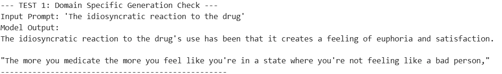
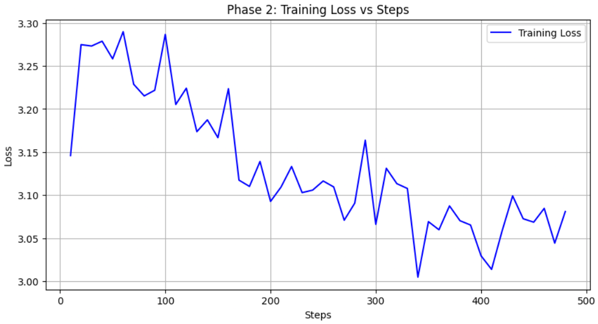
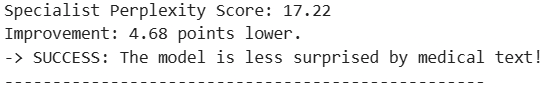
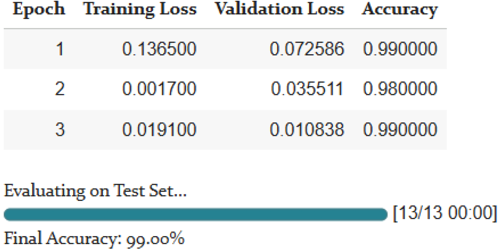
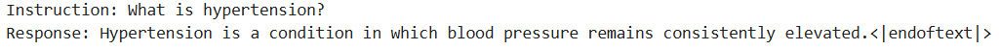
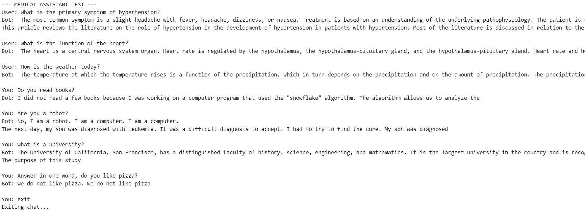

# GPT-2 Medical Fine-Tuning

This project demonstrates continued pre-training, domain adaptation, sequence classification, and instruction tuning using the GPT-2 (124M) model from Hugging Face Transformers.

The work was completed for the CMPE454 Applied Large Language Models course at Atilim University and focuses on adapting GPT-2 to the medical domain under limited computational resources using Google Colab.

---

## Project Overview

The project explores four major stages of LLM adaptation:

1. Baseline evaluation of GPT-2
2. Continued pre-training on PubMed abstracts
3. Sequence classification using a custom classification head
4. Instruction tuning for chatbot-style interaction

The assignment also investigates:

- Perplexity (PPL)
- Domain adaptation
- Instruction-following behavior
- Catastrophic forgetting
- Memory optimization techniques

---

## Technologies Used

- Python 3
- PyTorch
- Hugging Face Transformers
- Hugging Face Datasets
- Google Colab
- GPT-2 (124M)

---

## Dataset

### Continued Pre-Training

- ~6,000 PubMed abstracts
- Approximately 5.8 MB of medical-domain text

Dataset source:

- [PubMed Abstract Dataset](https://huggingface.co/datasets/uiyunkim-hub/pubmed-abstract)

### Classification

- 250 medical samples
- 250 general chit-chat samples

### Instruction Tuning

- 50 synthetic medical Q&A pairs

---

## Training Phases

### Phase 1 — Baseline Evaluation

- Loaded pretrained GPT-2
- Performed zero-shot generation
- Calculated baseline perplexity on medical text

### Phase 2 — Continued Pre-Training

- Fine-tuned GPT-2 on medical abstracts
- Observed perplexity reduction
- Observed medical-domain vocabulary adaptation

### Phase 3 — Sequence Classification

- Replaced the causal language modeling head with a classification head
- Trained a binary classifier:
  - Medical text
  - General chit-chat

### Phase 4 — Instruction Tuning

- Fine-tuned the model on instruction-response pairs
- Implemented chatbot-style prompting
- Analyzed instruction-following behavior and catastrophic forgetting

---

## Results

### Baseline Generation



### Baseline Perplexity


### Training Loss



### Post-Training Perplexity



### Classification Accuracy



### Instruction Tuning



### Final Chatbot Demo



---

## Key Observations

- Continued pre-training reduced perplexity on medical text.
- The model adopted academic medical language patterns after training.
- Instruction tuning enabled question-answer style interaction.
- Small instruction datasets caused repetitive responses and weak stopping behavior.
- The model exhibited catastrophic forgetting after aggressive specialization.

---

## Running the Project

Install dependencies:

```bash
pip install -r requirements.txt
```

Open the notebook:

```bash
jupyter notebook
```

or run directly using Google Colab.

## Repository Structure

```text
.
├── notebooks/
│   └── CMPE454_GPT2_Project.ipynb
├── report/
│   └── CMPE454_Report.pdf
├── results/
│   ├── baseline_generation.png
│   ├── baseline_ppl.png
│   ├── training_loss.png
│   ├── posttrain_ppl.png
│   ├── classification_accuracy.png
│   ├── instruction_format.png
│   └── final_chatbot_demo.png
├── data/
│   └── README.md
├── README.md
├── requirements.txt
├── LICENSE
└── .gitignore
```

## Notes
- Training was performed using the free version of Google Colab.
- FP16 precision and gradient accumulation were used to reduce memory usage.
- This project is educational and experimental in nature.
- The final chatbot is not intended for real medical usage.

## Acknowledgement

This project benefited from:

- Hugging Face documentation and tutorials
- Course lecture materials from NVIDIA DLI "Generative AI Teaching Kit" 
- AI-assisted coding support for debugging and workflow integration

All experiments, observations, and interpretations were manually verified by the author.

## References
- [Hugging Face Transformers Documentation](https://huggingface.co/docs/transformers/index)
- [Perplexity of Fixed-Length Models](https://huggingface.co/docs/transformers/perplexity)
- [Trainer API Reference](https://huggingface.co/docs/transformers/main_classes/trainer)
- [Gradient Accumulation Guide](https://huggingface.co/docs/transformers/v4.18.0/en/performance#gradient-accumulation)
- [AutoModelForSequenceClassification](https://huggingface.co/docs/transformers/model_doc/auto#transformers.AutoModelForSequenceClassification)
